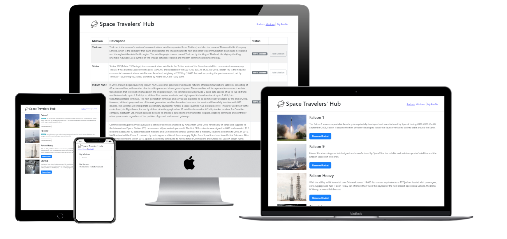

# Space Travelers 
> A web application for a company that provides commercial and scientific space travel services. The application will allow users to book rockets and join selected space missions.

## Built With

- JavaScript
- React
- Redux
- Bootstrap React

## Live Demo
[SpaceTravelers](https://space-travelers-react.netlify.app/)   

## Getting Started

To get a local copy follow these simple example steps.  

1.- Open the terminal window and clone the repository using this command:  
`git@github.com:leopiresgoss/space-travelers.git` 

2.- Change the directory to the react-bookstore directory  
`cd space-travelers`  
3.- Install the project's dependencies by running this command:   
`npm install`  
4.- Generate the dist folder using this command:  
`npm run build`  
5.- Run this command to see the page `npm start`  
6.- To see the code open the project in the code editor of your preference.  

## Author
👤 **Leonardo Pires Goss**
- GitHub: [@leopiresgoss](https://github.com/leopiresgoss)
- Twitter: [@leonardopgoss](https://twitter.com/leonardopgoss)
- Linkedin: [@leonardogoss](https://www.linkedin.com/in/leonardogoss/)

👤 **Victor Peralta**
- GitHub: [@VicPeralta](https://github.com/VicPeralta)
- Twitter: [@VicPeralta](https://twitter.com/VicPeralta)
- Linkedin: [@VicPeralta](https://www.linkedin.com/in/victor-peralta-gomez-648072107/)

## 🤝 Contributing

Contributions, issues, and feature requests are welcome!

Feel free to check the [issues page](https://github.com/leopiresgoss/space-travelers/issues).

## Show your support

Give a ⭐️ if you like this project!

## Acknowledgments

- A special thank for @fernandorpm for this amazing [README template](https://github.com/microverseinc/readme-template)

## 📝 License

This project is [MIT](./LICENSE.md) licensed.

